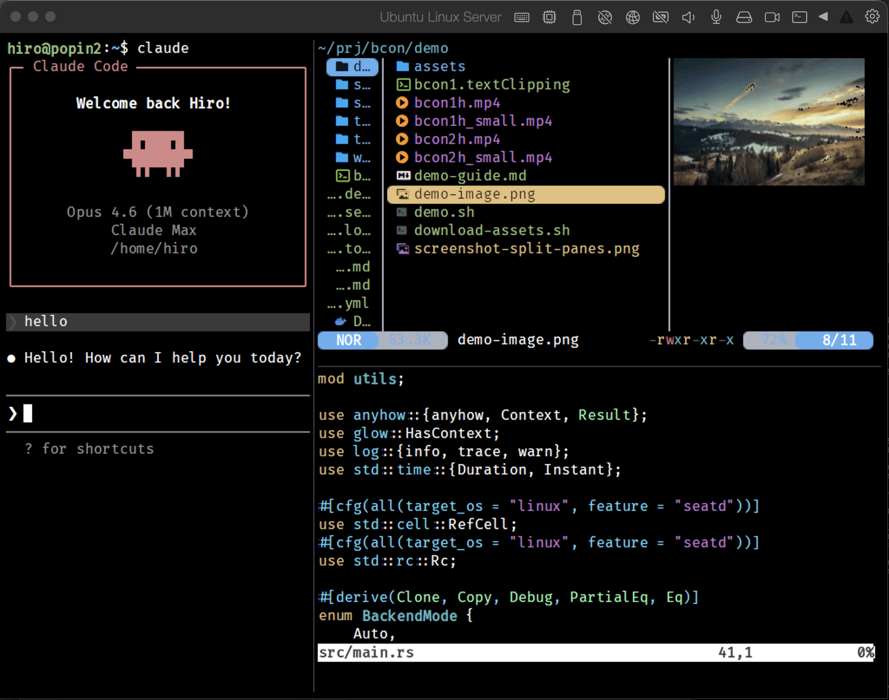

# bcon

[](https://opensource.org/licenses/MIT)
[](https://github.com/sanohiro/bcon/actions/workflows/ci.yml)
[](https://github.com/sanohiro/bcon/releases/latest)

Linux コンソール (TTY) 用 GPU アクセラレーション対応ターミナルエミュレータ — X11/Wayland 不要

**[ドキュメント](docs/)** · **[インストール](docs/installation.md)** · **[設定](docs/configuration.md)** · **[English](README.md)**

- **GPU レンダリング** — DRM/KMS 上の OpenGL ES でシャープ＆スムーズな描画
- **Sixel & Kitty グラフィックス** — ターミナル上で直接画像を表示
- **内蔵ペイン分割 & タブ** — tmux 不要、グラフィックスパススルー問題なし
- **日本語入力** — D-Bus 経由の fcitx5 統合、ベアコンソールで動作



## なぜ bcon？

AI コーディングツール（Claude Code、Codex、Gemini CLI など）の登場により、開発ワークフローは大きく変わりました。VSCode を開く機会は減り、ターミナルで過ごす時間が増えています。

ふと気づくと、X11/Wayland 上で動かしているのはターミナルエミュレータだけ — それなら、デスクトップ環境ごと省略できるのでは？

**bcon** はその答えです。Ghostty や Alacritty のようなモダンなターミナル体験を、Linux コンソール上で直接実現します。GPU アクセラレーション、True Color、Sixel/Kitty グラフィックス、日本語入力 — X11 なしで。

### bcon の役割

bcon は**画面分割とタブを内蔵**しています — 基本的なマルチプレクシングに tmux や screen は不要です。ターミナルマルチプレクサは Kitty graphics protocol のパススルーを壊すことが多く、bcon の画像表示機能が活かせなくなるため、内蔵分割が重要です。

もちろん外部ツールとの併用も可能です：

- **セッション管理**: tmux, screen (永続セッション / SSH 用)
- **ファイル操作**: yazi, ranger
- **エディタ**: Emacs, Neovim, Helix

**楽しい CLI ライフを。**

| | 実 TTY | GPU アクセラレーション | Kitty graphics | IME | 画面分割 |
|---|:---:|:---:|:---:|:---:|:---:|
| **bcon** | Yes | Yes | Yes | Yes | 内蔵 |
| kitty / alacritty / ghostty | No (X11/Wayland 必須) | Yes | ツールによる | デスクトップ IME | ツールによる |
| tmux / screen | Yes | No | パススルー制約あり | N/A | Yes |

## デモ

### スクリプト & 基本機能

https://github.com/user-attachments/assets/8576c907-1f7b-4582-8eb8-de04a853b604

### 実用例 (yazi, btop, Claude Code など)

https://github.com/user-attachments/assets/ebff498c-25b7-4662-8750-8d6e35661963

## 機能

### レンダリング
- **GPU レンダリング**: DRM/KMS + EGL + GBM 経由の OpenGL ES
- **シャープなテキスト**: ピクセルアライン済みグリフレンダリング
- **True Color**: 24bit フルカラーサポート
- **リガチャ**: フォントリガチャ対応 (リガチャフォントが必要 — [推奨フォント](docs/configuration.md#recommended-fonts)参照)
- **絵文字**: カラー絵文字レンダリング (Noto Color Emoji)
- **Powerline**: ピクセル精度の Powerline/Nerd Font グリフ
- **HiDPI スケーリング**: 設定可能な表示倍率 (1.0x - 2.0x)
- **HDR 検出**: EDID から HDR 対応を自動検出

### グラフィックス
- **Sixel グラフィックス**: ターミナル内画像表示
- **Kitty グラフィックスプロトコル**: 高速画像転送

### ターミナル
- **スクロールバック**: 設定可能なバッファ (デフォルト: 10,000 行)
- **マウスサポート**: 選択、ホイールスクロール、ボタンイベント (X10/SGR/URXVT/SGR-Pixels)
- **OSC 52 クリップボード**: エスケープシーケンスでクリップボード操作
- **ブラケットペースト**: セキュアなペーストモード
- **カラーアンダーライン**: SGR 58/59 対応 — 5 種のスタイル (単線/二重線/波線/点線/破線) + カラー指定
- **同期出力**: Mode 2026 — 高速更新アプリのちらつき防止
- **OSC 4/10/11/12**: パレット、前景色、背景色、カーソル色の動的変更
- **通知**: OSC 9 (iTerm2) / OSC 99 (Kitty) 通知プロトコル — トーストオーバーレイ＋プログレスバー

### 入力
- **キーボード**: evdev + xkbcommon による完全キーボードサポート
- **Kitty キーボードプロトコル**: モダンエディタ向けプログレッシブキーボードプロトコル (CSI u)
- **日本語入力**: D-Bus 経由の fcitx5 統合
- **IME 自動無効化**: vim/emacs などで自動的に IME を無効化
- **キーリピート**: 設定可能な遅延/レート

### 画面分割 & タブ
- **ペイン分割**: 二分木レイアウトによる水平・垂直分割
- **ペインナビゲーション**: 矢印キーまたは hjkl (vim プリセット) でフォーカス移動
- **ペインリサイズ**: キーボードショートカットで分割比を調整
- **ペインズーム**: アクティブペインをフルスクリーンに拡大/復元
- **タブ**: 複数タブ、タブバー表示
- **自動クローズ**: 終了したペインは自動的に閉じる
- **マウスフォーカス**: クリックでペインフォーカス切替

### UX
- **コピーモード**: Vim ライクなキーボードナビゲーション
- **テキスト検索**: スクロールバック内インクリメンタル検索 (Ctrl+Shift+F)
- **スクリーンショット**: PNG で保存 (PrintScreen または Ctrl+Shift+S)
- **フォント拡大縮小**: 実行時フォントサイズ変更 (Ctrl+Plus/Minus)
- **通知パネル**: 通知履歴の閲覧 (Ctrl+Shift+N)、ミュート切替 (Ctrl+Shift+M)
- **モニターホットプラグ**: モニター接続/切断を自動検知・切替
- **外部モニター優先**: HDMI/DP 接続時に自動切り替え (ラップトップ向け)
- **ビジュアルベル**: ベル文字で画面フラッシュ
- **URL 検出**: Ctrl+クリックで URL をコピー

## クイックスタート

日本語環境（CJK フォント + fcitx5 IME）が必要な場合は [日本語環境セットアップ](docs/installation.md#japanese-environment-setup) を参照してください。

```bash
# 1. インストール
curl -fsSL https://sanohiro.github.io/bcon/install.sh | sudo sh
sudo apt install bcon

# 2. (任意) Nerd Font をインストール (yazi, lsd 等のアイコン表示用)
#    詳細: docs/configuration.md#nerd-fonts-icons

# 3. 設定生成 & サービス有効化
sudo bcon --init-config=system,vim,jp  # または: system,emacs,jp / system,jp
sudo systemctl disable getty@tty2
sudo systemctl enable --now bcon@tty2

# 4. bcon に切り替え: Ctrl+Alt+F2
```

## ドキュメント

| ドキュメント | 内容 |
|-------------|------|
| **[インストールガイド](docs/installation.md)** | apt、日本語環境、ログインセッション、ソースビルド、rootless |
| **[設定リファレンス](docs/configuration.md)** | 設定ファイル詳細、プリセット、フォント、Nerd Fonts |
| **[キーバインド](docs/keybinds.md)** | キーバインド一覧 (Default / Vim / Emacs) + コピーモード |

## 動作要件

- DRM/KMS サポートのある Linux (Debian/Ubuntu 推奨)
- OpenGL ES 2.0+ 対応 GPU

## 制限事項

- **マルチシート (DRM リース)**: 非対応。bcon は GPU を排他的に使用します。
- **マルチモニタ**: 現在は1つのモニタにのみ出力。

## ライセンス

MIT

## 謝辞

インスピレーション:
- [Ghostty](https://github.com/ghostty-org/ghostty)
- [foot](https://codeberg.org/dnkl/foot)
- [yaft](https://github.com/uobikiemukot/yaft)
- [Alacritty](https://github.com/alacritty/alacritty)
